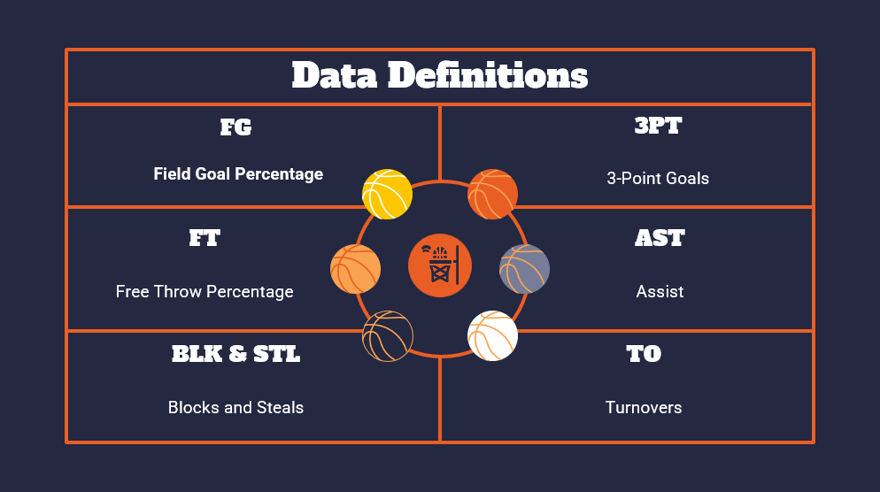

# Data Scientist

#### Technical Skills: Python, R, Java, SAS, SQL, MySQL, Tableau, Power BI, Microsoft Office (Advanced Excel), Salesforce, Sharepoint

## Education
- **University of Florida** (_December 2023_)
  - *M.S., Information Systems and Operations Management* 
    - Track: Data Science
- **University of Florida** (_May 2022_)
  - *B.S., Business Administration, Information Systems*
    - Minor: Asian Studies
    - Full-Ride Machen Florida Opportunity Scholarship & Bright Futures Academic Scholarship Recipient
  
## Work Experience
**Tampa Electric Company (TECO)** | (_October 2022 – May 2023_)
- **Meter Analytics Project: Lead Data Scientist** Gainesville, FL
  - In MS-ISOM Program's Analytics Practicum, led a data analytics consulting team. Following CRISP-DM, analyzed data from over 800,000 AMI meters, assessing energy usage patterns to develop machine learning algorithms.

**The Selling Factory** | (_July 2021 – December 2021_)
- **Sales Development Representative Intern** Gainesville, FL
  - Collaborated on a B2B sales team, managing clients in Salesforce. Delivered weekly call campaign performance metrics of objectives and sales forecasts to supervisors and team.

**University of Florida, Infinity Hall** | (_June 2019 – April 2022_)
- **Administrative Specialist** Gainesville, FL
  - Directed administration of main student resident hall service desk. Oversight liaison for all student halls.

## Projects

### 2023 Top 100 NBA Players Visualizations
- I completed this project my final semester of graduate school, Decemeber 2023, for a data visualization class.
- I created all the visualizations in Tableau with input from my team and designed the presentation (slides can be found in my NBA Project GitHub folder).
  
#### Objective:
This project aims to conduct a detailed analysis of the top 100 NBA players’ performance,
focusing specifically on the correlation between player demographics (e.g. age and height)
and the nine standard statistical categories for the 2023-2024 season (using pre-season
projected and current performance measures). This analysis is not only pertinent to sports
enthusiasts and analysts but also holds significant value in the domains of both sports
management and betting industries. Understanding the impact of demographics on
performance can aid in player development, team composition internally, betting strategies
for industry outsiders and plenty of other real life applicable relevant uses.

#### Chosen Datasets & Sources:
1. Main Data Set: Top 100 NBA Players Projections & Current Performance Statistics for 2023 - 2024: <a href="https://hashtagbasketball.com/fantasy-basketball-rankings"> Hashtag Basketball</a>
2. 2022-2023 NBA Player Demographics: <a href="https://www.kaggle.com/datasets/justinas/nba-players-data"> Kaggle</a>

#### Preliminary Analysis
#### Hypothesis: 
Age correlates with certain improvements or declines in specific statistical performance categories. For instance, older players might show a pattern of underperforming in some projected performance categories for the season. However we also hypothesize that the negative impact of old age is overestimated in projections as modern
medicine and longevity-focused practices have improved dramatically in recent years. 
#### Observations: 
A cursory examination of the datasets reveal certain trends such as players within certain age groups exhibiting distinct patterns in their performance metrics. For example, younger players may show higher scores in metrics related to physical athleticism, such as points per game, rebounds, or steals. In contrast, older players might demonstrate superiority in strategic aspects of the game, like assists-to-turnover ratio or three-point shooting accuracy. We also may witness that projections to real life performance may vary quite a bit between generations of players. Older players might be expected to regress significantly while on the other hand younger players might be expected to improve.

<a href="https://public.tableau.com/views/NBA_17244393402170/1_OverperformingUnderperforming?:language=en-US&:sid=&:redirect=auth&:display_count=n&:origin=viz_share_link"> View My 2023 Top 100 NBA Players Visualizations on Tableau Public</a>

- Field Goal Percentage is probably the most important indicator of efficiency, as it shows how many times players are scoring points out of a hundred (excluding free throws). 
- 3-Point Goals are points scored from a farther distance, which are worth 3 instead of 2. 
- Free throw percentage is the amount of times players score free throws out of a hundred. 
- Assists are the passes to the players who end up scoring, blocks and steals are self-explanatory, usually related to defensive-role players, and turnovers are the times where players lose the ball to the other team.

