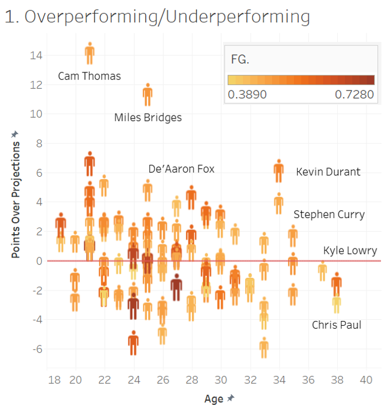
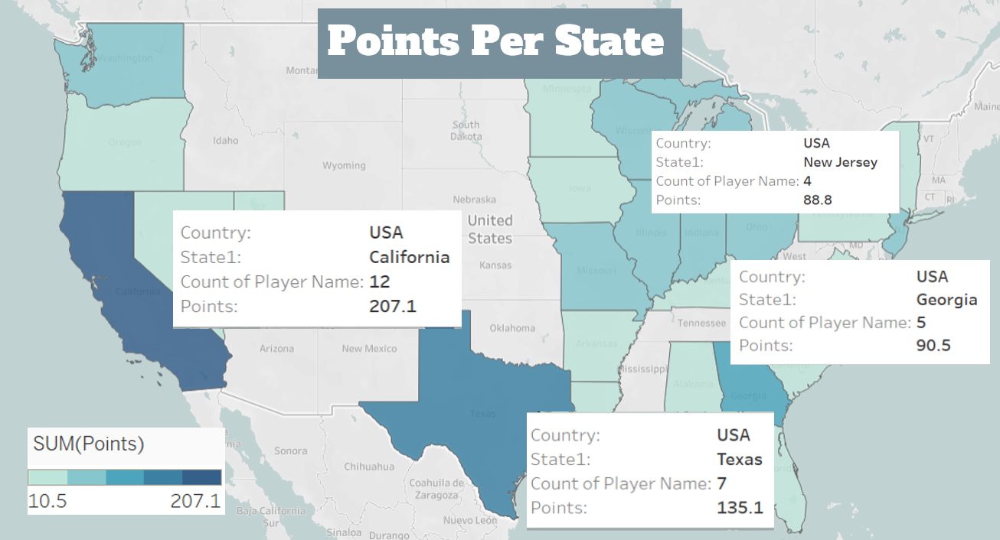
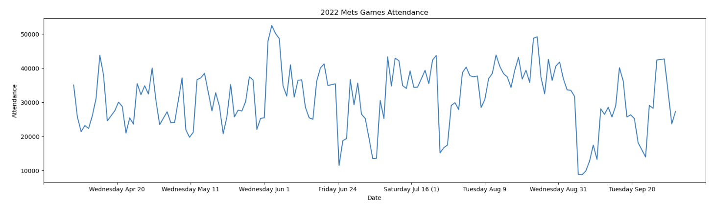
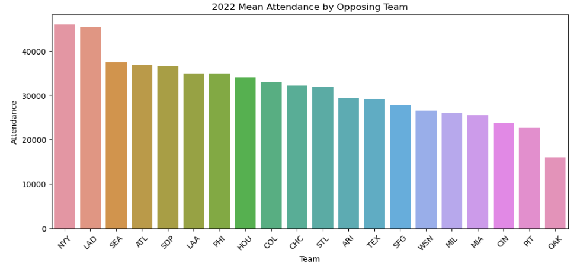
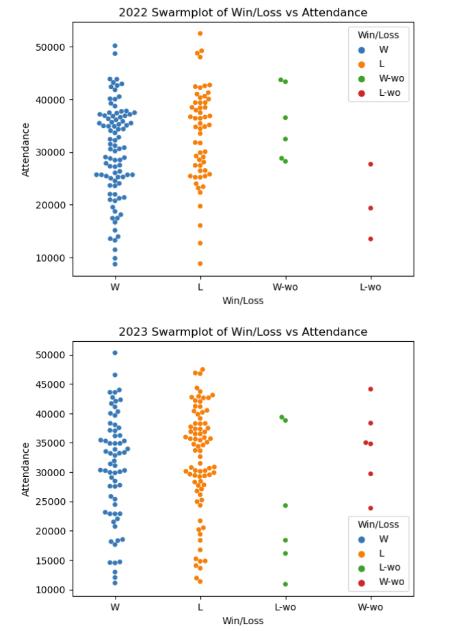
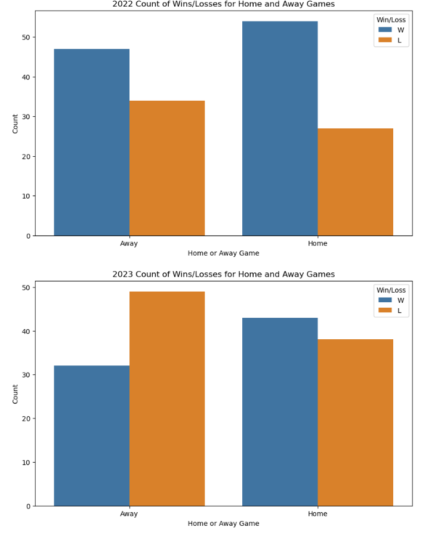

# Data Scientist Portfolio

#### Technical Skills: Python, R, Java, SAS, SQL, MySQL, Tableau, Power BI, Microsoft Office (Advanced Excel), Salesforce, Sharepoint

# Projects

# 2023 Top 100 NBA Players Visualizations
- I completed this project my final semester of graduate school, Decemeber 2023, for a data visualization class.
- For a more in-depth explanation of the visualizations, the Tableau file, and PowerPoint can be found in my
## <a href="https://github.com/kirsten-hugh/portfolio/tree/main/NY_Mets_Project"> NBA Project GitHub folder</a>
  
#### Objective:
This project aims to conduct a detailed analysis of the top 100 NBA players’ performance,
focusing specifically on the correlation between player demographics (e.g. age and height)
and the nine standard statistical categories for the 2023-2024 season (using pre-season
projected and current performance measures). This analysis is not only pertinent to sports
enthusiasts and analysts but also holds significant value in the domains of both sports
management and betting industries. Understanding the impact of demographics on
performance can aid in player development, team composition internally, betting strategies
for industry outsiders and plenty of other real life applicable relevant uses.

#### Chosen Datasets & Sources:
1. <a href="https://hashtagbasketball.com/fantasy-basketball-rankings"> Top 100 NBA Players Projections & Current Performance Statistics for 2023 - 2024 on Hashtag Basketball</a>
2. <a href="https://www.kaggle.com/datasets/justinas/nba-players-data"> 2022-2023 NBA Player Demographics on Kaggle</a>

#### Preliminary Analysis
#### Hypothesis: 
Age correlates with certain improvements or declines in specific statistical performance categories. For instance, older players might show a pattern of underperforming in some projected performance categories for the season. However, the negative impact of old age is overestimated in projections as modern medicine and longevity-focused practices have improved dramatically in recent years. 
#### Observations: 
A cursory examination of the datasets reveal certain trends such as players within certain age groups exhibiting distinct patterns in their performance metrics. For example, younger players may show higher scores in metrics related to physical athleticism, such as points per game, rebounds, or steals. In contrast, older players might demonstrate superiority in strategic aspects of the game, like assists-to-turnover ratio or three-point shooting accuracy. We also may witness that projections to real life performance may vary quite a bit between generations of players. Older players might be expected to regress significantly while on the other hand younger players might be expected to improve.

## <a href="https://public.tableau.com/views/NBA_17244393402170/1_OverperformingUnderperforming?:language=en-US&:sid=&:redirect=auth&:display_count=n&:origin=viz_share_link"> View My 2023 Top 100 NBA Players Visualizations on Tableau Public</a>
#### Below are a couple of the visualizations I created for this project ----
#### Performance:

- Points Over Projection vs Age is visualization that shows how much are players are overperforming/underperforming compared to what experts thought they would do this season. Here the players who are majorly overperforming their projections are younger players.
- The gradient of orange is each player’s Field Goal Percentage (measure of efficiency; how many times players are scoring points (excluding free throws) out of 100). The darker shade of orange indicating that those players are more efficient.
- A red line was added at 0 to delineate and emphasize the baseline whether players were either over the line, thus overperforming or underperforming, marked below the line.

#### Points Scored by State:

- A majority of the top 100 players are from the US - 76/100 players. California has the most amount of points scored: 207.1 points and 12 players from here. This is followed by Texas with 7 players scoring 135.1 points. Finally, with the third largest amount of points is Georgia with 5 players scoring 90.5 points of this season. 
- A stepped color key was chosen instead of a gradient for these maps to make cutoffs of points scored less ambiguous.

# NY Mets Analysis and Visualizations
- I completed this as an exploratory Python project Feb 2024.
- To view more visualizations from this project, the .ipynb file can be found in my
## <a href="https://github.com/kirsten-hugh/portfolio/tree/main/NY_Mets_Project"> NY Mets Project GitHub folder</a>
  
#### Objective:
This project aims to do an exploratory analysis of the New York Mets' games of the years 2022 and 2023, focusing on attendance. The goal is to discover trends and factors such as the opposing team being played and wins/losses' effects, if any, on in-person attendance to the games.

#### Chosen Datasets & Sources:
1. <a href="https://www.baseball-reference.com/teams/NYM/2022-schedule-scores.shtml#all_team_schedule"> 2022 Team Game-by-Game Schedule on Baseball Reference </a> 
2. <a href=" https://www.baseball-reference.com/teams/NYM/2023-schedule-scores.shtml#all_team_schedule"> 2023 Team Game-by-Game Schedule on Baseball Reference </a>

#### Below are a few of the visualizations I created for this project ----

#### Time Series Analysis of NY Mets Attendance in 2022 and 2023:

- Between 2022 and 2023 there were more poorly attended games in 2023 indicated by the more frequent drops in the 2023 time series. This could indicate that the NY Met's performed better in 2022 and thus had better overall attendance.

#### Mean Attendance by Opposing Team:

- The NYY, LAD, and SEA were the top three opposing teams that brought in the highest attendance to Mets' games in 2022. This implies that these three teams are the Mets' top rivals.
- 

- The NYY, LAD, and TOR were the top three opposing teams that brought in the highest attendance to Mets' games in 2023. This implies that these three teams are the Mets' top rivals this season. Between 2022 and 2023 we can infer that the Mets' biggest rivals are the NYY and the LAD because games against these teams brought in the highest attendence both years. Especially, the NYY having the top attended games implies a fierce rivalry as both teams are New York teams.

#### Swarmplots of Win/Loss vs Attendance:

- For both 2022 and 2023, there were slightly more losses than wins for the NYM when there were very high attended games (about 45,000+ attendees). In 2022: 2 games were won and 4 were lost and in 2023: 2 games were won and 3 were lost for these very high attended games.
- In 2022, there is a high volume of wins concentrated around mid-high attended games (about 35,000 - 38,000 attendees). While in 2023 the spread of the swarm between wins and losses is closer to an equal amount overall.
- At a glance, there were more overall wins in 2022 than 2023. In both years there was an equal amount of win-walk-offs (6), but a higher number of loss-walk-offs in 2023 (increasing from 3 to 6 games L-wo).

#### Count of Wins/Loss for Home and Away Games

- As predicted, across both years there are more wins than losses at home games, where the NYM are more comfortable playing (and have more fans supporting them in the stands).
- Though in 2022, the opposite is not true for away games, where more games were actually won than lost - thus indicating an overall better performing season. While in 2023, significantly more games were lost than won at away games.
- Additionally, for 2023, there is not a major increase between games won and lost at home - when games won at home in 2022 were roughly double the games lost at home.

